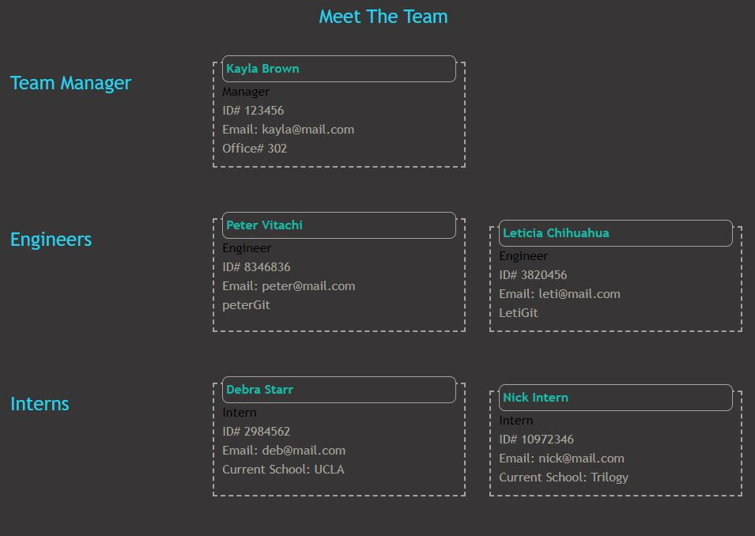

# TeamTitans

  ## Table of Contents
  1. [Project Description](#project-description)
  2. [Installation Instructions](#installation-instructions)
  3. [How To Use](#how-to-use)
  4. [How To Contribute](#how-to-contribute)
  5. [Testing](#testing)
  6. [Contact Me](#contact-me)

  ## Project Description
  * Node cl-application to create HTML webpage for team roster contact and other person details.

  ## Installation Instructions
  * Running "npm install" prior to launch should install necessary packages. We recommend inquirer 8.2.4. You may need to install jest if not already installed globally.

  ## How To Use
  * Use this application to quickly create a well-organized HTML webpage displaying team personnel organized by role. No more manually creating or formatting elements! 
  [See Demo](https://drive.google.com/file/d/1OSY-h6Gm_JNygWJnDqIAjLJA3EDzwVHo/view?usp=sharing)

  ## How To Contribute
  * Contact me on GitHub to contribute! If you simply wish to modify for personal use, feel free to copy this repo.
  
  ## Testing
  * This application uses jest for testing. Current tests evaluate object.parameter endpoints to ensure models are structured properly. 
  
  ## Sample
  

  ## Contact Me
  * Find me on Github: [kabdomora](http://github.com/kabdomora)
  * For additional feedback, email me at [kaylabrown@mednet.ucla.edu](mailto:kaylabrown@mednet.ucla.edu)
